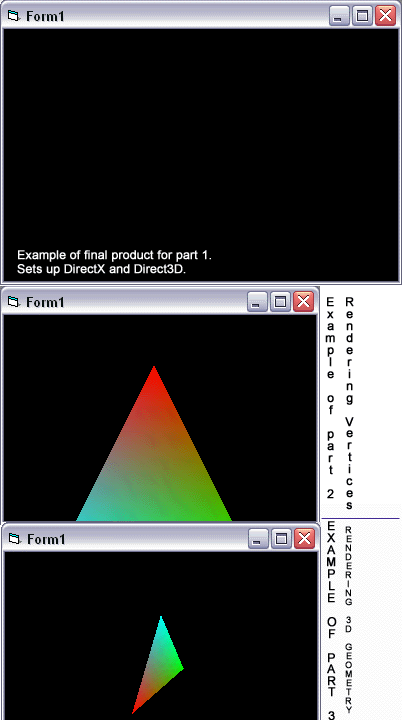



## A Three Part Direct3D Tutorial

### Description

This is a 17 page tutorial on how to setup DirectX, create an object, render vertices, and render 3D Geometry. The final sample program is a multi-color triangle rotating over the y-axis. This tutorial explains what each step means so the user understands everything. This tutorial is accompanied with example source code (that actually runs) for each part. There are also screenshots throughout the tutorial to give the visual learners out there a better idea of what to do.
 
### More Info
 

             |
---                |---
**Submitted On**   |2002-11-18 16:47:52
**By**             |[Simbro](https://github.com/Planet-Source-Code/PSCIndex/blob/master/ByAuthor/simbro.md)
**Level**          |Intermediate
**User Rating**    |5.0 (45 globes from 9 users)
**Compatibility**  |VB 6\.0
**Category**       |[DirectX](https://github.com/Planet-Source-Code/PSCIndex/blob/master/ByCategory/directx__1-44.md)
**World**          |[Visual Basic](https://github.com/Planet-Source-Code/PSCIndex/blob/master/ByWorld/visual-basic.md)
**Archive File**   |[A\_Three\_Pa14998411182002\.zip](https://github.com/Planet-Source-Code/simbro-a-three-part-direct3d-tutorial__1-40856/archive/master.zip)

